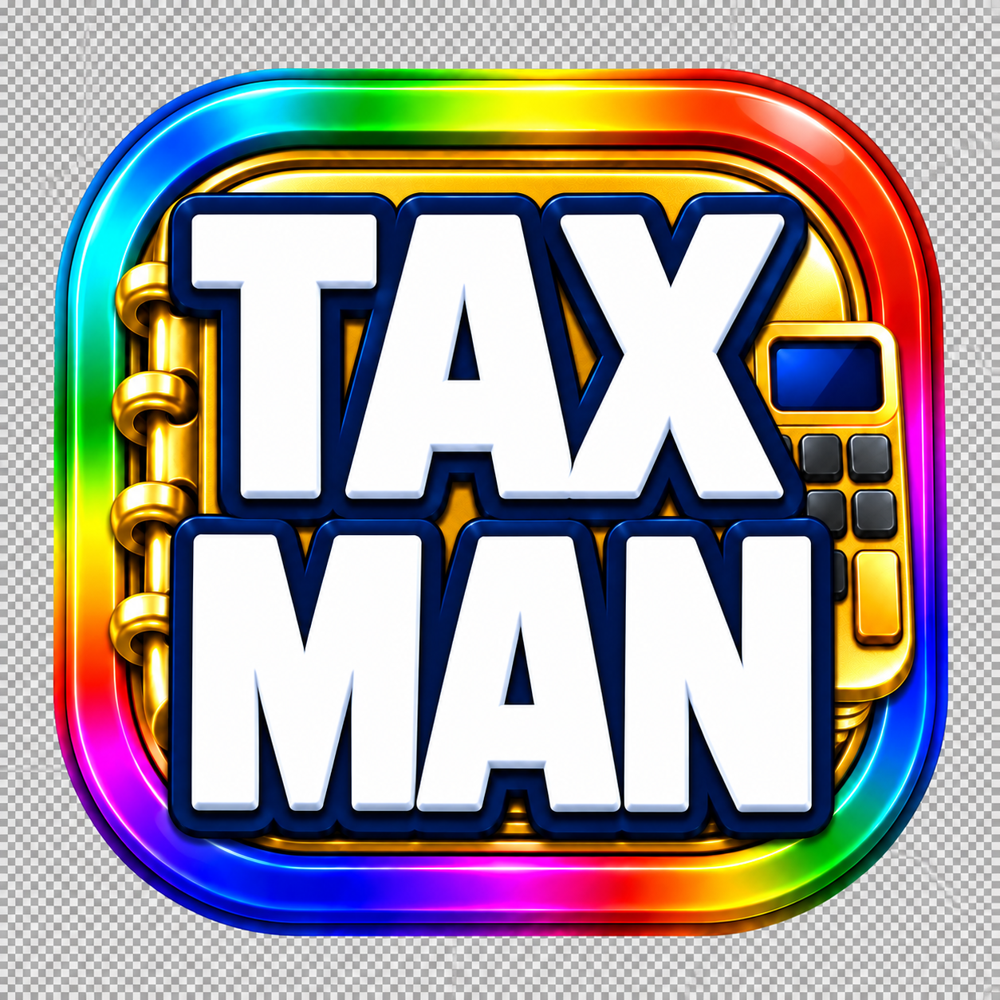

# Tax Ledger



Local Windows desktop ledger for preparing income and expenditure records for a tax preparer. Version 0.2.3 is multi-year and local-only.

## Use

1. Open the app and add companies/sources, or choose **Create new company/source** while entering a transaction.
2. Add one transaction per income item or expense. Dates accept compact entry such as `090826`, `09/08/2026`, or `2026-09-08`.
3. Choose the year in the top-right year selector to review its totals.
4. Review totals on the Dashboard and use Reports & Backup to export the selected-year PDF/CSV or a full JSON backup.
5. Use Help > Keyboard shortcuts for faster entry. The Companies & Sources page includes a guarded Clear company data control for setup cleanup.

The app stores records locally on the computer. It does not connect to a cloud service or submit tax forms. The report is a recordkeeping aid; final tax treatment must be confirmed by the tax preparer.

The TAXMAN icon is stored at `src/assets/taxman-icon.png` and is reused by the Windows app, installer, public site, and documentation.

## Development

```text
npm install
npm test
npm start
npm run dist
```

The Windows installer and portable executable are written to `dist`.

Public project pages:

- GitHub: https://github.com/oppdown/TaxMan
- Downloads and changelog: https://taxman.speedy-star-8288.chatgpt.site
